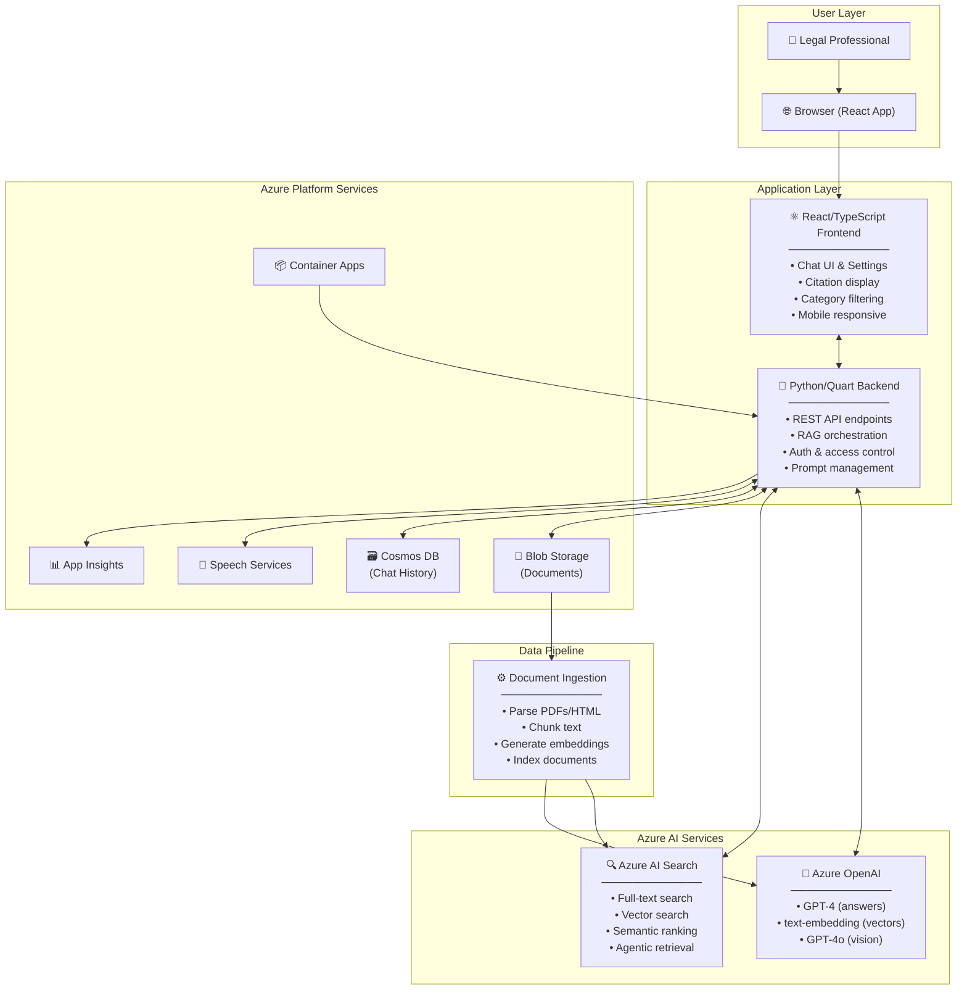
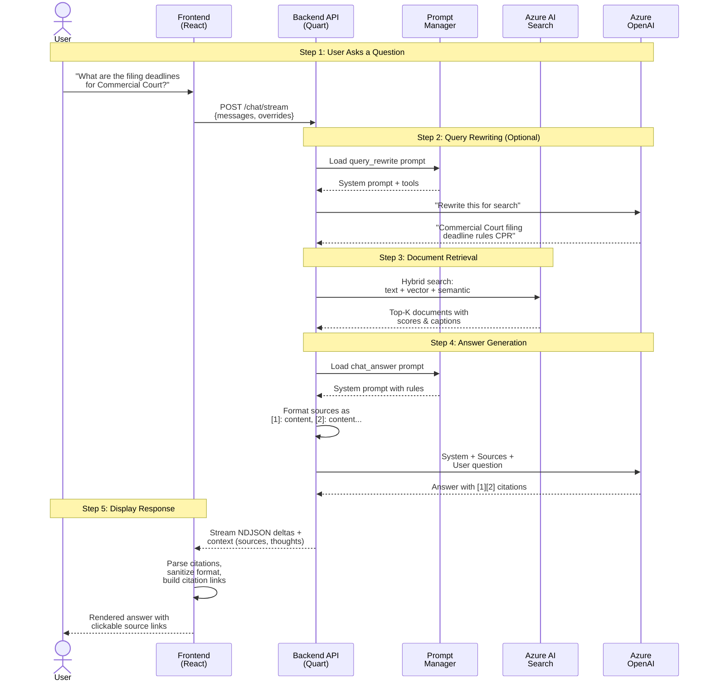
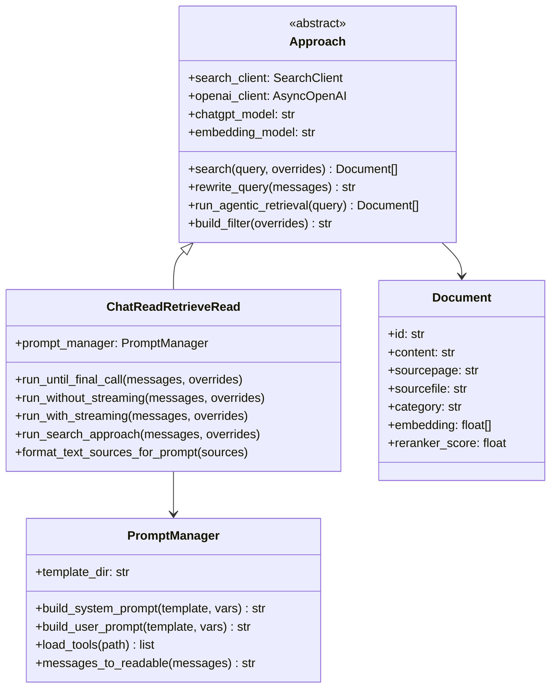
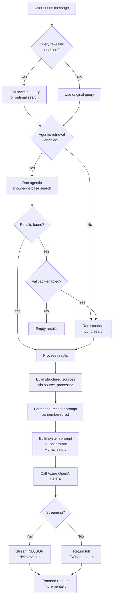
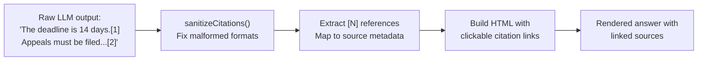
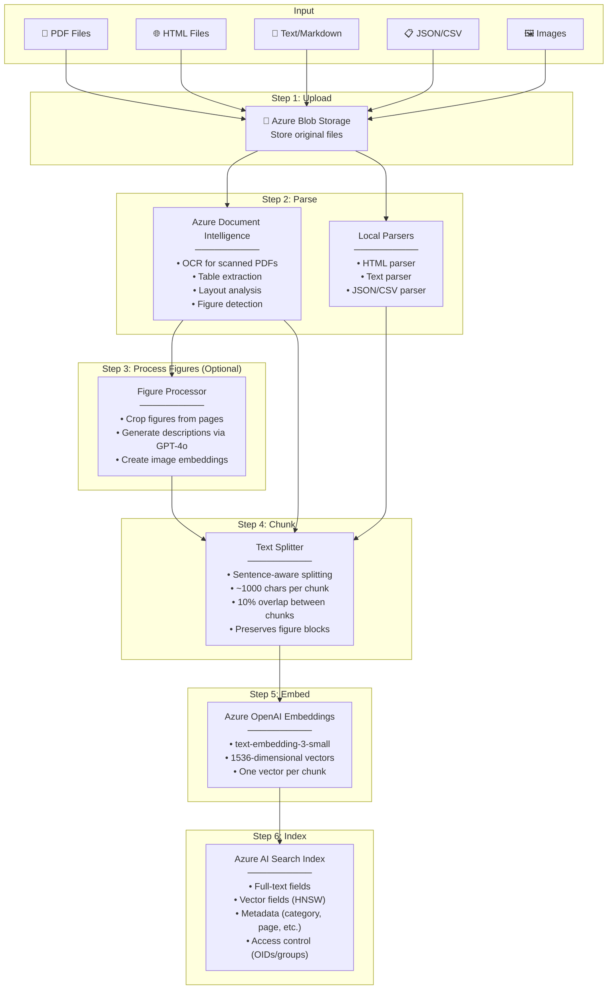
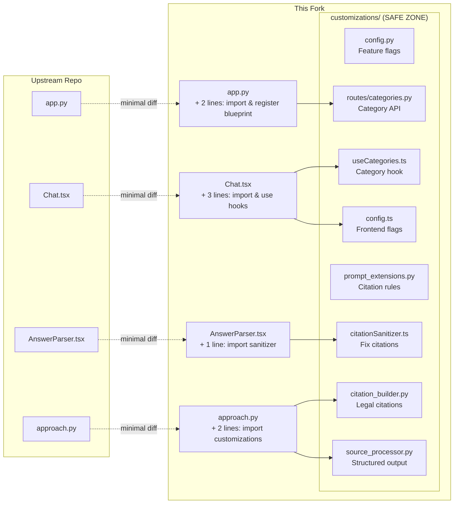
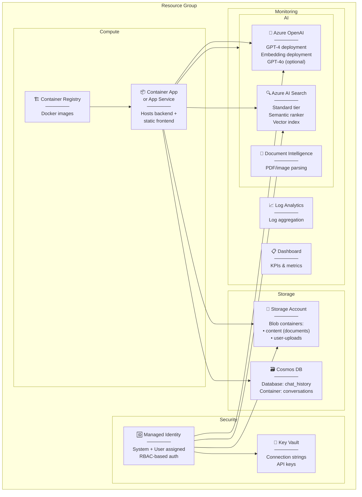
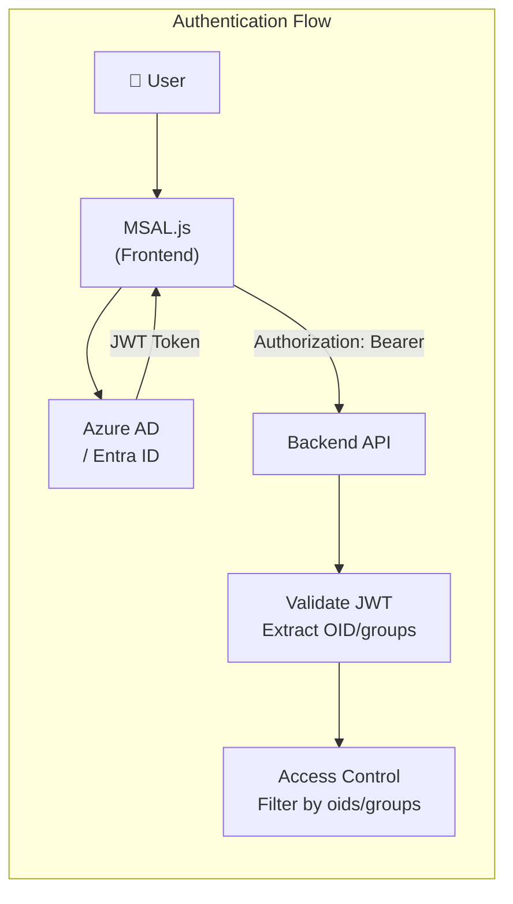
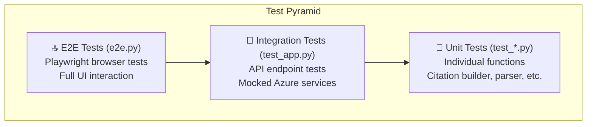

# Legal RAG Solution — Complete Architecture & Documentation

> **Audience:** Developers with foundational Python and AI engineering knowledge who need to deeply understand this solution's architecture, data flows, and codebase structure.

---

## Table of Contents

1. [What This Solution Does](#1-what-this-solution-does)
2. [High-Level Architecture](#2-high-level-architecture)
3. [The RAG Pattern Explained](#3-the-rag-pattern-explained)
4. [Backend Deep Dive](#4-backend-deep-dive)
5. [Frontend Deep Dive](#5-frontend-deep-dive)
6. [Data Ingestion Pipeline](#6-data-ingestion-pipeline)
7. [The Customizations Layer (Merge-Safe Architecture)](#7-the-customizations-layer)
8. [Azure Infrastructure](#8-azure-infrastructure)
9. [Authentication & Security](#9-authentication--security)
10. [Testing Strategy](#10-testing-strategy)
11. [Deployment](#11-deployment)
12. [Key Configuration & Environment Variables](#12-key-configuration--environment-variables)
13. [Glossary](#13-glossary)

---

## 1. What This Solution Does

This is a **Retrieval Augmented Generation (RAG)** application customized for the **UK legal domain** (specifically Civil Procedure Rules). It provides a ChatGPT-like conversational interface that answers legal questions by:

1. **Searching** a curated index of legal documents (PDFs, HTML, etc.)
2. **Retrieving** the most relevant passages using hybrid search (text + vector + semantic ranking)
3. **Generating** an AI-powered answer grounded in those retrieved passages
4. **Citing** sources with structured legal citations (e.g., "1.1, D5 - Filing deadlines (p. 210), Commercial Court Guide")

### What makes this different from vanilla ChatGPT?

| Aspect | ChatGPT | This RAG Solution |
|--------|---------|-------------------|
| Knowledge source | Pre-trained model weights | Your indexed legal documents |
| Hallucination risk | High — no grounding | Low — answers must cite sources |
| Up-to-date info | Training cutoff | As fresh as your index |
| Domain expertise | General knowledge | Targeted legal domain prompts |
| Transparency | No citations | Every claim linked to source documents |

---

## 2. High-Level Architecture

The system has four main layers:



### How the pieces fit together

| Component | Technology | Purpose |
|-----------|-----------|---------|
| **Frontend** | React 19 + TypeScript + Fluent UI v9 | Chat interface, settings, citation display |
| **Backend** | Python 3.10+ / Quart (async Flask) | API server, RAG orchestration, auth |
| **Azure OpenAI** | GPT-4, text-embedding-3-small | Answer generation, query embeddings |
| **Azure AI Search** | Hybrid (text + vector + semantic) | Document retrieval with ranking |
| **Blob Storage** | Azure Storage Account | Store original documents |
| **Cosmos DB** | Serverless (optional) | Persist chat conversation history |
| **App Insights** | OpenTelemetry | Monitoring, tracing, diagnostics |
| **Container Apps** | Managed containers (or App Service) | Host the application |

---

## 3. The RAG Pattern Explained

**RAG = Retrieval Augmented Generation**. Instead of relying solely on the LLM's training data, we first *retrieve* relevant documents, then *augment* the LLM's prompt with those documents so it can *generate* a grounded answer.

### The Chat Flow — Step by Step



### What happens inside each step:

#### Step 2 — Query Rewriting
The user's conversational question ("What are the filing deadlines?") may not be a great search query. The LLM rewrites it into an optimized search string, removing conversational noise and adding relevant terms.

#### Step 3 — Hybrid Search
Three search strategies run in parallel and their results are merged:

| Strategy | How it works | Good at |
|----------|-------------|---------|
| **Full-text** | BM25 keyword matching | Exact term matches, legal terminology |
| **Vector** | Cosine similarity of embeddings | Semantic meaning, paraphrases |
| **Semantic ranking** | ML re-ranker on top results | Relevance ordering, captions |

#### Step 4 — Answer Generation
The LLM receives a carefully constructed prompt containing:
- **System message**: Rules about citation format, legal domain behavior
- **Sources**: Retrieved documents formatted as `[1]: content, [2]: content...`
- **User message**: The original question
- **Chat history**: Previous turns for multi-turn conversations

#### Step 5 — Streaming
Responses stream as **NDJSON** (newline-delimited JSON), where each line is:
```json
{"delta": {"role": "assistant", "content": "The filing deadline"}}
{"delta": {"content": " is specified in CPR Part 7.[1]"}}
{"delta": {"content": null}, "context": {"data_points": {...}, "thoughts": [...]}}
```

---

## 4. Backend Deep Dive

### 4.1 Directory Structure

```
app/backend/
├── app.py                          # Main Quart application & API routes
├── main.py                         # Entry point (imports app)
├── prepdocs.py                     # Document ingestion CLI
├── approaches/
│   ├── approach.py                 # Base class — search, citations, common logic
│   ├── chatreadretrieveread.py     # Main RAG approach (query → search → answer)
│   ├── promptmanager.py            # Jinja2 prompt template renderer
│   └── prompts/
│       ├── chat_answer.system.jinja2       # System prompt for answer generation
│       ├── chat_answer.user.jinja2         # User message template (includes sources)
│       ├── query_rewrite.system.jinja2     # Query optimization prompt
│       └── chat_query_rewrite_tools.json   # Tool schema for structured rewriting
├── customizations/                 # 🔒 Merge-safe legal domain features
│   ├── config.py                   # Feature flags
│   ├── prompt_extensions.py        # Citation format rules
│   ├── approaches/
│   │   ├── citation_builder.py     # Legal citation construction
│   │   └── source_processor.py     # Structured source output
│   └── routes/
│       └── categories.py           # GET /api/categories endpoint
└── prepdocslib/                    # Document ingestion library
    ├── filestrategy.py             # Orchestrates ingestion
    ├── searchmanager.py            # Azure Search index management
    ├── fileprocessor.py            # Parse + split coordination
    ├── textsplitter.py             # Sentence-aware chunking
    ├── pdfparser.py                # PDF extraction
    ├── htmlparser.py               # HTML extraction
    ├── embeddings.py               # Vector embedding generation
    └── blobmanager.py              # Blob storage uploads
```

### 4.2 The Approach Pattern

The backend uses a **Strategy Pattern** for RAG approaches. Currently there is one main approach, but the architecture supports adding more.



### 4.3 `app.py` — API Endpoints

| Endpoint | Method | Purpose |
|----------|--------|---------|
| `/chat` | POST | Non-streaming chat (returns full response) |
| `/chat/stream` | POST | Streaming chat (returns NDJSON stream) |
| `/config` | GET | Frontend configuration & feature flags |
| `/auth_setup` | GET | MSAL authentication configuration |
| `/content/<path>` | GET | Serve document content from blob storage |
| `/upload` | POST | Upload user documents |
| `/list_uploaded` | GET | List user's uploaded documents |
| `/delete_uploaded` | DELETE | Remove uploaded documents |
| `/speech` | POST | Text-to-speech synthesis |
| `/chat_history/*` | Various | CRUD for chat history (Cosmos DB) |
| `/api/categories` | GET | **CUSTOM:** Category facets for filtering |

### 4.4 `approach.py` — The Search Engine

The `search()` method is the heart of document retrieval:

```python
async def search(
    self,
    top: int,                    # Number of results (default ~3-5)
    query_text: str,             # The (rewritten) search query
    use_text_search: bool,       # Enable BM25 full-text
    use_vector_search: bool,     # Enable vector similarity
    use_semantic_ranker: bool,   # Enable ML re-ranking
    use_semantic_captions: bool, # Extract relevant snippets
    ...
) -> list[Document]:
```

**Filter building** supports:
- Category filtering: `category eq 'Commercial Court'`
- Multi-category OR: `category eq 'A' or category eq 'B'`
- Access control (OIDs/groups): Only show docs the user can access

**Fuzzy search** (custom): Adds `~1` or `~2` operators to search terms for typo tolerance.

### 4.5 `chatreadretrieveread.py` — The Main RAG Workflow



**Key implementation detail — Source numbering:**
Sources are formatted as simple numbered references (`[1]: content`, `[2]: content`) before being sent to the LLM. This makes it easy for the LLM to cite sources as `[1]`, `[2]`, etc. The frontend then maps these numbers back to the full structured citation metadata (document name, page, subsection, storage URL).

### 4.6 Prompt Templates (Jinja2)

#### System Prompt (`chat_answer.system.jinja2`)
Tells the LLM how to behave:
- Only answer from provided sources
- Use `[1]`, `[2]` citation format
- Say "I don't know" if sources don't contain the answer
- Generate follow-up questions (optional)

#### User Prompt (`chat_answer.user.jinja2`)
Contains the actual sources and question:
```
Sources:
[1]: Filing deadlines are set out in CPR Part 7...
[2]: The Commercial Court Guide requires...

Question: What are the filing deadlines?
```

#### Query Rewrite Prompt (`query_rewrite.system.jinja2`)
Instructs the LLM to transform conversational questions into optimal search queries, removing noise and adding relevant terms.

---

## 5. Frontend Deep Dive

### 5.1 Directory Structure

```
app/frontend/src/
├── api/
│   ├── api.ts                  # HTTP client functions
│   └── models.ts               # TypeScript type definitions
├── pages/
│   ├── chat/Chat.tsx           # Main chat page
│   └── layout/Layout.tsx       # App shell/layout
├── components/
│   ├── Answer/
│   │   ├── Answer.tsx          # Answer display component
│   │   └── AnswerParser.tsx    # Citation extraction & linking
│   ├── QuestionInput/          # User input field
│   ├── Settings/               # Developer settings panel
│   ├── SupportingContent/      # Source documents panel
│   ├── AnalysisPanel/          # Thought process visualization
│   ├── HistoryPanel/           # Chat history sidebar
│   └── UserChatMessage/        # User message bubble
├── customizations/             # 🔒 Merge-safe custom code
│   ├── config.ts               # Feature flags
│   ├── citationSanitizer.ts    # Fix malformed citations
│   ├── useCategories.ts        # Category filter hook
│   ├── ChatInputControls.tsx   # Mobile-responsive controls
│   └── index.ts                # Barrel exports
└── locales/                    # i18n translations (9 languages)
```

### 5.2 Component Interaction

```mermaid
flowchart TD
    subgraph "Chat Page (Chat.tsx)"
        QI[QuestionInput<br/>─────────<br/>Text input + send button<br/>Category dropdown<br/>Search depth selector]
        Settings[Settings Panel<br/>─────────<br/>Retrieval mode<br/>Semantic ranker<br/>Temperature<br/>Query rewriting]
        ChatArea[Chat Area]
    end

    subgraph "Message Display"
        UCM[UserChatMessage<br/>─────────<br/>Shows user's question]
        Answer[Answer Component<br/>─────────<br/>Renders AI response<br/>Clickable citations]
    end

    subgraph "Citation & Analysis"
        AP[AnalysisPanel<br/>─────────<br/>Thought steps<br/>Retrieved documents<br/>Query rewrite details]
        SC[SupportingContent<br/>─────────<br/>Source document text<br/>Citation metadata]
    end

    subgraph "Data Layer"
        API[api.ts<br/>─────────<br/>chatApi()<br/>configApi()<br/>getCitationFilePath()]
        Parser[AnswerParser.tsx<br/>─────────<br/>Extract citations<br/>Sanitize format<br/>Build HTML links]
    end

    QI -->|user types & sends| API
    API -->|POST /chat/stream| Backend["Backend API"]
    Backend -->|NDJSON stream| API
    API -->|response data| ChatArea
    ChatArea --> UCM
    ChatArea --> Answer
    Answer --> Parser
    Parser -->|citation click| SC
    Parser -->|analysis click| AP
    Settings -->|overrides| QI
```

### 5.3 The Answer Parser — Citation Processing

The `AnswerParser.tsx` is one of the most complex frontend components. It transforms raw LLM text (with `[1]`, `[2]` references) into clickable, linked citations.



**Citation sanitization** fixes 5+ common LLM output patterns:

| Pattern | Raw Output | Fixed Output |
|---------|-----------|--------------|
| Duplicated with space | `1. 1` | `[1]` |
| Duplicated no space | `cost 1.1 increases` | `cost [1] increases` |
| After parenthesis | `copies) 1.` | `copies)[1]` |
| End of paragraph | `proceedings 1.` | `proceedings.[1]` |
| Range citations | `[69–81]` | `[69]` |
| Repeated adjacent | `[1][1]` | `[1]` |

### 5.4 Configuration & Feature Flags

The `/config` endpoint returns feature flags that control UI rendering:

```typescript
{
    showCategoryFilter: true,       // Show category dropdown
    showMultimodalOptions: true,    // Show image search options
    showSemanticRankerOption: true,  // Show semantic ranker toggle
    showReasoningEffortOption: true, // Show reasoning effort slider
    showAgenticRetrievalOption: true,// Show agentic retrieval toggle
    streamingEnabled: true,         // Enable streaming responses
}
```

### 5.5 Key TypeScript Types

```typescript
// What the frontend sends to the backend
interface ChatAppRequest {
    messages: { role: string; content: string }[];
    context: {
        overrides: {
            retrieval_mode: "hybrid" | "vectors" | "text";
            semantic_ranker: boolean;
            semantic_captions: boolean;
            query_rewriting: boolean;
            include_category: string;     // Filter by document category
            temperature: number;           // 0.0-1.0 creativity
            top: number;                   // Number of results to retrieve
            suggest_followup_questions: boolean;
            use_agentic_knowledgebase: boolean;
        };
    };
    session_state: any;
}

// Structured citation metadata from backend
interface SourceTextItem {
    id: string;
    citation: string;        // "1.1, D5 - Filing deadlines, Commercial Court Guide"
    content: string;         // Actual text content
    sourcepage: string;      // "D5"
    sourcefile: string;      // "Commercial Court Guide.pdf"
    category: string;        // "Commercial Court"
    storageurl: string;      // Blob URL
    subsection_id: string;   // "1.1"
}
```

---

## 6. Data Ingestion Pipeline

Before the RAG system can answer questions, documents must be **parsed, chunked, embedded, and indexed**. This is the ingestion pipeline.

### 6.1 End-to-End Flow



### 6.2 Text Splitting — How Documents Become Chunks

The text splitter is **sentence-aware**, meaning it never breaks in the middle of a sentence.

```
Original Document (3000 characters):
┌─────────────────────────────────────────────────┐
│ The Civil Procedure Rules govern all aspects     │
│ of civil litigation in England and Wales.        │
│ Part 7 covers claims. Filing must be done        │
│ within the prescribed time limits. Late filings  │
│ may be struck out. The court has discretion...   │
│ [continues for many more paragraphs]             │
└─────────────────────────────────────────────────┘

After Splitting (3 chunks with 10% overlap):
┌──────── Chunk 1 (1000 chars) ────────┐
│ The Civil Procedure Rules govern...   │
│ ...within the prescribed time limits. │
│                          ┌────────────┤ ← overlap
└──────────────────────────┤            │
┌──────── Chunk 2 (1000 chars) ────────┐
│ ...prescribed time limits. Late      │
│ filings may be struck out...         │
│                          ┌────────────┤ ← overlap
└──────────────────────────┤            │
┌──────── Chunk 3 (800 chars) ─────────┐
│ ...struck out. The court has         │
│ discretion...                        │
└──────────────────────────────────────┘
```

**Why overlap?** If a relevant passage spans a chunk boundary, the overlap ensures the information appears in at least one complete chunk.

### 6.3 The Search Index Schema

Each chunk becomes a document in Azure AI Search with this schema:

| Field | Type | Purpose |
|-------|------|---------|
| `id` | String | Unique document ID (`filename-page-section`) |
| `content` | String | The chunk text (searchable, full-text) |
| `sourcepage` | String | Page reference (e.g., `D5`, `page-3`) |
| `sourcefile` | String | Original filename |
| `category` | String | Document category (filterable facet) |
| `embedding` | Vector | 1536-dim embedding for vector search |
| `storageUrl` | String | Blob storage URL for original document |
| `subsection_id` | String | Legal subsection (e.g., "1.1", "A4.3") |
| `updated` | String | Last update timestamp |
| `oids` | Collection | User IDs with access (for ACL) |
| `groups` | Collection | Group IDs with access (for ACL) |

### 6.4 Running Ingestion

```bash
# Local ingestion (parse, chunk, embed, index)
./scripts/prepdocs.sh

# Or directly:
python app/backend/prepdocs.py ./data/*.pdf \
    --storageaccount <account> \
    --searchservice <service> \
    --index <index-name>
```

---

## 7. The Customizations Layer

### 7.1 Why a Merge-Safe Architecture?

This project is a **fork** of the upstream `Azure-Samples/azure-search-openai-demo`. The upstream repo is actively developed with new features and fixes. To safely pull upstream updates without merge conflicts, all custom code lives in isolated `/customizations/` directories.



### 7.2 Integration Points (Lines Changed in Upstream Files)

Only **~10 lines total** are added to upstream files:

| File | What's Added |
|------|-------------|
| `app.py` | `from customizations.routes import categories_bp` + `app.register_blueprint(categories_bp)` |
| `Chat.tsx` | `import { useCategories } from "../../customizations"` + hook usage |
| `AnswerParser.tsx` | `import { sanitizeCitations } from "../../customizations/citationSanitizer"` |
| `approach.py` | `from customizations.approaches import citation_builder, source_processor` |
| `vite.config.ts` | Add `/api/categories` proxy route |

### 7.3 Feature Flag System

Both backend and frontend use feature flags to enable/disable custom features:

**Backend (`customizations/config.py`):**
```python
CUSTOM_FEATURES = {
    "category_filter": True,              # /api/categories endpoint
    "legal_domain_prompts": True,         # Legal-specific system prompts
    "citation_sanitizer": True,           # Fix malformed citation output
    "enhanced_feedback": True,            # Rich feedback metadata
    "agentic_force_query_on_empty": True, # Force retry on no results
    "agentic_fallback_search": True,      # Fallback to standard search
}
```

**Frontend (`customizations/config.ts`):**
```typescript
CUSTOM_FEATURES = {
    categoryFilter: true,                 // Category dropdown in UI
    citationSanitizer: true,             // Fix [1][1] → [1] etc.
    citationMetadataDisplay: true,       // Show subsection/category
    preserveSubsectionBoundaries: true,  // Split multi-subsection docs
    structuredCitationMatching: true,    // Enhanced citation linking
    answerParagraphs: true,              // Format long answers
    showCitationsPanel: true,            // Citation side panel
    adminMode: false,                    // Override via ?admin=true
}
```

### 7.4 Legal Citation Builder

The citation builder constructs three-part citations for legal documents:

```
┌─────────────────────────────────────────────────────────┐
│  "1.1, D5 - Filing deadlines (p. 210), Commercial      │
│   Court Guide"                                          │
│                                                         │
│   Part 1: Subsection ID (1.1)                          │
│   Part 2: Source page + Title (D5 - Filing deadlines)  │
│   Part 3: Category/Document name (Commercial Court)    │
└─────────────────────────────────────────────────────────┘
```

Subsection detection uses multiple strategies with fallback:
1. Indexed `subsection_id` field (highest priority)
2. Regex patterns in content text (e.g., "# 1.1 Heading", "Rule 31.1")
3. Encoded source page names (e.g., "PD3E-1.1" → "1.1")
4. Direct source page pattern matching

---

## 8. Azure Infrastructure

### 8.1 Resource Map



### 8.2 Provisioning via Bicep

Infrastructure is defined as code using **Bicep** templates in the `infra/` directory:

| File | Resources |
|------|----------|
| `main.bicep` | Orchestrator — parameters, variables, module calls |
| `core/ai/cognitiveservices.bicep` | Azure OpenAI account |
| `core/search/search-services.bicep` | Azure AI Search |
| `core/storage/storage-account.bicep` | Blob storage |
| `core/host/container-apps.bicep` | Container Apps environment |
| `core/monitor/applicationinsights.bicep` | App Insights |
| `core/db/cosmos.bicep` | Cosmos DB |
| `core/security/keyvault.bicep` | Key Vault |
| `core/security/role.bicep` | RBAC role assignments |

### 8.3 Deployment Options

| Option | When to Use | Command |
|--------|------------|---------|
| Container Apps (default) | Serverless, auto-scaling | `azd up` |
| App Service | Traditional PaaS, fixed compute | Set `AZURE_USE_APP_SERVICE=true` then `azd up` |
| Local Development | Testing | `app/start.sh` or VS Code tasks |

---

## 9. Authentication & Security



**Security layers:**
1. **Authentication**: Azure AD / Entra ID via MSAL library
2. **Authorization**: JWT tokens carry user OID and group memberships
3. **Access Control**: Documents have `oids` and `groups` fields — search filters ensure users only see documents they're permitted to access
4. **Managed Identity**: Backend authenticates to Azure services (OpenAI, Search, Storage) via managed identity — no API keys in code
5. **Key Vault**: Secrets stored securely, referenced at deployment time

---

## 10. Testing Strategy

### 10.1 Test Types



### 10.2 Test Files

| File | Tests |
|------|-------|
| `tests/e2e.py` | Browser-based full-stack tests via Playwright |
| `tests/test_app.py` | Backend API endpoints with mocked services |
| `tests/test_chatapproach.py` | ChatReadRetrieveRead logic |
| `tests/test_customizations_citation_builder.py` | Legal citation construction |
| `tests/test_customizations_config.py` | Feature flag behavior |
| `tests/test_customizations_routes.py` | `/api/categories` endpoint |
| `tests/test_citation_methodology.py` | Citation extraction patterns |
| `tests/test_searchmanager.py` | Search index management |

### 10.3 Running Tests

```bash
# Activate virtual environment
source .venv/bin/activate

# Run all tests
python -m pytest tests/

# Run specific test file
python -m pytest tests/test_app.py -v

# Run with coverage
pytest --cov --cov-report=annotate:cov_annotate

# Run E2E tests (requires frontend build first)
cd app/frontend && npm run build && cd ../..
python -m pytest tests/e2e.py
```

---

## 11. Deployment

### 11.1 Full Deployment

```bash
# Login to Azure
azd auth login

# Deploy everything (provision + deploy)
azd up
```

This command:
1. Provisions all Azure resources via Bicep
2. Builds the frontend (`npm run build`)
3. Packages the backend as a container
4. Deploys to Container Apps (or App Service)
5. Runs post-deploy hooks (auth setup, optional ingestion)

### 11.2 Partial Deployments

```bash
# Only re-provision infrastructure
azd provision

# Only re-deploy application code
azd deploy

# Deploy specific function apps (cloud ingestion)
azd deploy document-extractor
azd deploy figure-processor
azd deploy text-processor
```

### 11.3 Local Development

```bash
# Option 1: VS Code tasks (recommended)
# Run the "Development" task which starts both frontend and backend

# Option 2: Manual
cd app/frontend && npm run dev          # Frontend at http://localhost:5173
cd app/backend && quart run -p 50505    # Backend at http://localhost:50505

# Option 3: Script
cd app && ./start.sh
```

---

## 12. Key Configuration & Environment Variables

### Backend Environment Variables

| Variable | Purpose | Example |
|----------|---------|---------|
| `AZURE_STORAGE_ACCOUNT` | Blob storage account name | `stlegalrag123` |
| `AZURE_SEARCH_SERVICE` | AI Search service name | `search-legalrag` |
| `AZURE_SEARCH_INDEX` | Search index name | `gptkbindex` |
| `AZURE_OPENAI_SERVICE` | OpenAI service name | `oai-legalrag` |
| `AZURE_OPENAI_CHATGPT_MODEL` | Chat model deployment | `gpt-4` |
| `AZURE_OPENAI_CHATGPT_DEPLOYMENT` | Deployment name | `chat` |
| `AZURE_OPENAI_EMB_MODEL_NAME` | Embedding model | `text-embedding-3-small` |
| `AZURE_OPENAI_EMB_DEPLOYMENT` | Embedding deployment | `embedding` |
| `USE_VECTORS` | Enable vector search | `true` |
| `USE_MULTIMODAL` | Enable image understanding | `true` |
| `USE_AGENTIC_KNOWLEDGEBASE` | Enable agentic retrieval | `true` |
| `AZURE_USE_AUTHENTICATION` | Enable Azure AD auth | `true` |
| `AZURE_COSMOSDB_ACCOUNT` | Cosmos DB for chat history | `cosmos-legalrag` |

### Frontend Configuration

The frontend reads its configuration from the backend `/config` endpoint at startup. No separate frontend environment variables are needed — all configuration flows through the backend.

---

## 13. Glossary

| Term | Definition |
|------|-----------|
| **RAG** | Retrieval Augmented Generation — enriching LLM prompts with retrieved documents |
| **Hybrid Search** | Combining full-text (BM25) and vector similarity search |
| **Semantic Ranking** | ML-based re-ranking of search results for relevance |
| **Vector Embedding** | A numerical representation of text meaning (1536 floats) |
| **Chunking** | Splitting documents into smaller overlapping segments |
| **HNSW** | Hierarchical Navigable Small World — algorithm for fast vector search |
| **Agentic Retrieval** | AI Search feature where the search service uses an LLM to plan and execute complex queries |
| **NDJSON** | Newline-Delimited JSON — streaming format (one JSON object per line) |
| **Quart** | Async Python web framework (async version of Flask) |
| **Bicep** | Azure's domain-specific language for infrastructure-as-code |
| **azd** | Azure Developer CLI — tool for provisioning and deploying |
| **MSAL** | Microsoft Authentication Library — handles Azure AD login |
| **OID** | Object Identifier — unique user ID in Azure AD |
| **ACL** | Access Control List — determines who can see which documents |
| **Jinja2** | Python templating engine used for prompt templates |
| **Fluent UI** | Microsoft's React component library |
| **BM25** | Best Match 25 — classic full-text ranking algorithm |

---

## Quick Reference: Where to Find Things

| I want to... | Look at... |
|---------------|-----------|
| Understand the chat API | `app/backend/app.py` → `/chat` routes |
| Modify the RAG logic | `app/backend/approaches/chatreadretrieveread.py` |
| Change how search works | `app/backend/approaches/approach.py` → `search()` |
| Edit system prompts | `app/backend/approaches/prompts/*.jinja2` |
| Add a new API endpoint | Create in `app/backend/customizations/routes/` |
| Change the chat UI | `app/frontend/src/pages/chat/Chat.tsx` |
| Fix citation display | `app/frontend/src/components/Answer/AnswerParser.tsx` |
| Add a feature flag | `app/backend/customizations/config.py` + `app/frontend/src/customizations/config.ts` |
| Modify document parsing | `app/backend/prepdocslib/` |
| Change Azure resources | `infra/main.bicep` + related module files |
| Add tests | `tests/` directory, matching the test type |
| Deploy to Azure | `azd up` from root |
