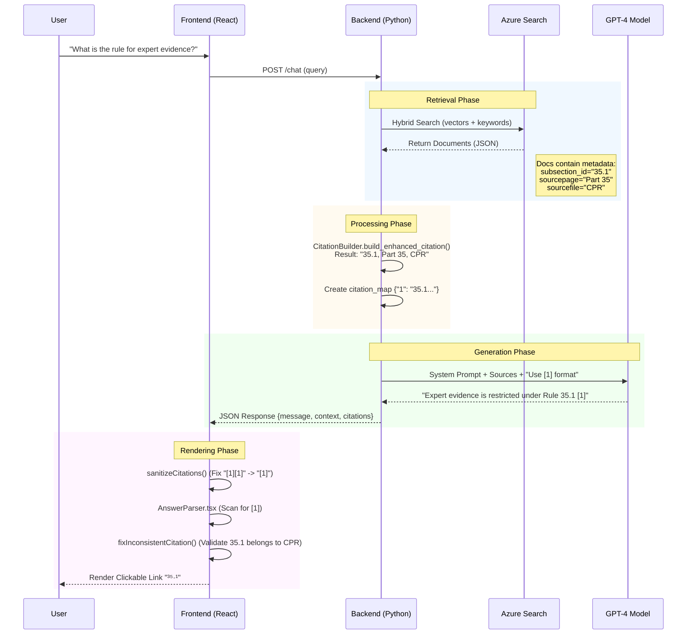
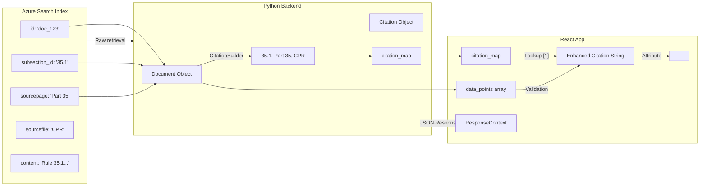

# Detailed Technical Specification: Legal Citation System

This document provides a code-level deep dive into the citation system, explaining the exact regex patterns, data structures, and validation logic used from ingestion to frontend rendering.

## 1. Data Ingestion & Indexing

The system relies on extracting "citeable units" (subsections) during ingestion. This logic allows the RAG system to cite specific rules (e.g., "35.1") rather than whole documents.

### 1.1 Ingestion Script Logic
**File**: `app/backend/push_court_guides.py` (and similar ingestion scripts)

Documents are processed before upload to Azure AI Search. Two key fields are computed and stored in the index:

*   `subsection_id`: The primary identifier for the chunk (e.g., "35.1").
*   `subsections`: A list of all subsections found in the text chunk.

```python
# Pseudo-code logic from ingestion
extracted = SubsectionExtractor.extract_first_subsection(content)
derived = extract_from_sourcepage(sourcepage)
doc['subsection_id'] = extracted or derived or ""
```

### 1.2 Azure Search Schema
The index schema (`cpr-index`) includes these custom fields:
*   `subsection_id` (Edm.String): Filterable, Retrievable
*   `sourcepage` (Edm.String): Human readable (e.g., "Part 35 - Experts")
*   `sourcefile` (Edm.String): Filename (e.g., "CPR")

---

## 2. Backend Runtime: Citation Building

When valid documents are retrieved, the backend constructs "Enhanced Citations" before sending them to the LLM.

**File**: `app/backend/customizations/approaches/citation_builder.py`

### 2.1 Extraction Priority
The `CitationBuilder` determines the citation label using this strict priority order:

1.  **Indexed Metadata** (`doc.subsection_id`): If the ingestion script successfully populated this field, it is authoritative.
2.  **Content Scan**: If metadata is missing, the first 20 lines of the `content` field are scanned for regex matches.
3.  **Encoded Sourcepage**: If no content match, it parses the `sourcepage` field (e.g., `PD3E-1.1` → `1.1`).
4.  **Direct Patterns**: Finally, scans `sourcepage` for direct rule patterns.

### 2.2 Regex Patterns (`CONTENT_SUBSECTION_PATTERNS`)
The system recognizes these specific legal numbering formats in document content:

| Pattern Regex | Matching Examples | Description |
|---------------|-------------------|-------------|
| `^([A-Z]\d+\.\d+)\b` | `A4.1`, `B2.3` | Court Guide sections |
| `^(\d+\.\d+)\b` | `1.1`, `35.4` | Standard numeric rules |
| `^(Rule \d+(?:\.\d+)?)\b` | `Rule 31.1` | Explicit "Rule" prefix |
| `^(Para \d+(?:\.\d+)?)\b` | `Para 5.2` | Paragraph references |
| `^(Part \d+)\b` | `Part 35` | Whole Part references |

### 2.3 Citation Construction
The builder combines extracted data into a comma-separated string:
> `{subsection}, {sourcepage}, {sourcefile}`

**Examples:**
- `35.1, Part 35 - Experts, CPR`
- `D5.1, D5 - Filing (p. 20), Commercial Court Guide`

### 2.4 Context Construction & LLM Prompting

This is the bridge where retrieval meets generation. The backend transforms the search results into a specific context format that allows the LLM to learn *what* to cite.

**1. The "List of Sources"**
The usage of citations relies on a clean, numbered list injected into the system prompt. The backend (`chatreadretrieveread.py`) iterates through the top search results and assigns them a temporary ID (1-based index).

*Format sent to LLM:*
```text
[1]: 35.1 Expert evidence shall be restricted to that which is reasonably required to resolve the proceedings.
[2]: D5.1 The court may order that expert evidence is to be given by a single joint expert.
```

**2. The System Prompt Instructions**
The prompt (`chat_answer_question.prompty`) explicitly instructs the model on how to map these numbered blocks to citations in its answer:

> "Each source has a number enclosed in square brackets... refer to these sources by their numbers."
> "Every sentence must end with a citation."
> "Format: Sentence content.[1]"

**3. The Generation Process**
1.  **Read**: The LLM reads the user question ("What is the restriction on expert evidence?").
2.  **Match**: It finds the answer in the context block labeled `[1]`.
3.  **Write**: It generates the answer text based on that content.
4.  **Cite**: Because it used information from block `[1]`, it appends `[1]` to the sentence.

**4. The Response Payload**
The backend sends both the answer and the metadata map to the frontend:
```json
{
  "message": "Expert evidence is restricted to what is reasonably required.[1]",
  "context": {
    "citation_map": {
      "1": "35.1, Part 35 - Experts, CPR",
      "2": "D5.1, D5 - Filing, Commercial Court Guide"
    }
  }
}
```
*Note: The LLM only sees "[1]", it never sees the complex "35.1, Part 35..." string. The backend handles that mapping.*

---

## 3. Frontend logic: Parsing & Validation

The frontend enforces strict logic to prevent "hallucinated" citations (where the LLM cites a rule that isn't actually in the source document).

**File**: `app/frontend/src/components/Answer/AnswerParser.tsx`

### 3.1 Classification (`classifySubsection`)
First, the citation string is parsed to identify its type:

*   **Alpha**: `D5.1` (Starts with letter) → Court Guides
*   **Numeric**: `35.1` (Starts with digit) → CPR Parts or PDs
*   **Rule/Para**: `Rule 31.1` → Specific entity

### 3.2 Inconsistency Checks (`fixInconsistentCitation`)
This function runs three specific validation checks against the retrieved `data_points`.

#### Check 1: Alpha Subsection Mismatch
*   **Trigger**: Citation is Alpha type (`D5.1`) BUT document is `Part` or `PD` (e.g., "CPR Part 35").
*   **Logic**: This is invalid. A CPR Part cannot contain a Court Guide section.
*   **Fix**: Scans all retrieved documents for a "Court Guide" file that contains "D.5" or "D5" in its sourcepage or content. If found, rebinds the citation to that file.

#### Check 2: Numeric Subsection Mismatch
*   **Trigger**: Citation is Numeric type (`35.1`) BUT document is NOT `Part`/`PD` (e.g., "Commercial Court Guide").
*   **Logic**: This is invalid. A Court Guide typically references its own sections (A, B, C...), not numeric CPR rules.
*   **Fix**: Scans documents for a `Part` or `PD` matching the major number (e.g., "Part 35"). If found, rebinds.

#### Check 3: Missing Marker
*   **Trigger**: Citation uses explicit "Rule" or "Para" prefix.
*   **Logic**: Verifies the text "Rule" or "Para" actually appears in the referenced sourcepage `sourcepage` or `content`.
*   **Fix**: If missing, searches other data points for the marker.

---

## 4. Frontend Logic: Click Matching

When a user clicks a citation `[1]`, the system must find the correct content blob to display.

**File**: `app/frontend/src/components/Answer/Answer.tsx`

### 4.1 Matching Strategy (`findMatchingSupportingContent`)
The system tries 4 strategies in order of precision:

1.  **Exact Full Match**:
    *   Logic: `dp.subsection_id === sub && dp.sourcepage === page && dp.sourcefile === file`
    *   Result: Perfect link.

2.  **Content Start Match**:
    *   Logic: `RegExp(^${subsection}).test(dp.content)` AND metadata matches.
    *   Use Case: When `subsection_id` is missing but the text starts with "35.1 ...".

3.  **Exact Metadata Match**:
    *   Logic: `dp.sourcepage === page && dp.sourcefile === file`
    *   Use Case: Fallback if granular subsection isn't found (links to page).

4.  **Fuzzy Match**:
    *   Logic: `dp.sourcepage.includes(page)` OR `page.includes(dp.sourcepage)` ...
    *   Use Case: Handles slight formatting differences (e.g., "Part 35" vs "Part 35 - Experts").

---

## 5. Visual Data Flows

### 5.1 End-to-End Citation Sequence

This diagram completely visualizes the journey of a citation from a user's question to the final interactive link.



### 5.2 Metadata Propagation Flow

This diagram details exactly how data fields move and transform through the system layers.



---

## 6. Input Sanitization

Before processing, raw LLM output is cleaned to fix common formatting errors.

**File**: `app/frontend/src/customizations/citationSanitizer.ts`

### 6.1 Regex Fixes
*   **Range Expansion**: `[1-3]` → `[1] [2] [3]`
*   **Unbracketed**: `1.1` (at line end) → `[1]`
*   **Float Confusion**: `1. 1` or `1.1` → `[1]` (LLMs often confuse citation index 1 with paragraph 1.1).
*   **Adjacent Collapsing**: `[1][2]` → `[1] [2]` (Adds space for readability).

### 6.2 Streaming Handling
During text streaming, partial citations (e.g., `[1`) are hidden until the closing bracket `]` arrives to prevent UI flickering.
